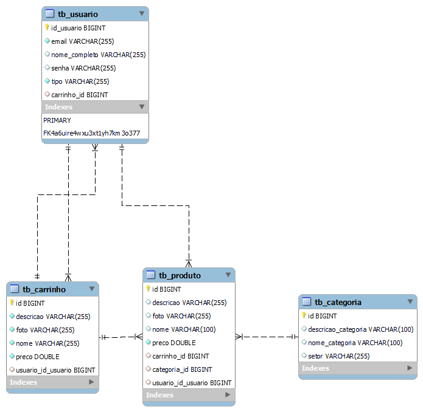

    
    <h1>Sunflower</h1>

##  Sobre

O projeto envolve a criação de uma plataforma de e-commerce para a Sunflower, especializada em equipamentos de energia solar. O site permitirá que clientes comprem uma ampla variedade de produtos solares e acessem conteúdos educativos, como artigos e e-books.

## Tecnologias utilizadas

|  |  |  |  |
| :--: | :--: | :--: | :--: |
| Java | Spring | MySQL | IntelliJ |

## Instalação

Antes de começar, certifique-se de ter as seguintes ferramentas instaladas em sua máquina:

- [Java](https://www.oracle.com/java/technologies/javase-downloads.html)
- [Maven](https://maven.apache.org/)
- [Git](https://git-scm.com/)
- [MySQL](https://www.mysql.com/downloads/)

Siga estas etapas para instalar e executar o projeto:
1. Clone o repositório: `git clone git@github.com:projetosUninove/sunflower-backend.git`

2. Compile o projeto usando o Maven: `mvn clean install`

3. Execute o projeto: `java -jar Backend_Ecommerce/target/e-commerce-0.0.1-SNAPSHOT.jar`

O aplicativo Spring será executado na porta padrão 8080. Você pode acessá-lo em http://localhost:8080.

## Arquitetura MVC

A escolha da arquitetura MVC para a realização deste projeto se baseia em diversas considerações que visam garantir um desenvolvimento eficiente e de alta qualidade. Abaixo, está alguns dos motivos que fundamentam a escolha:

 - **Simplicidade Inicial:** A arquitetura MVC oferece uma estrutura inicialmente mais simples para o projeto, crucial para o entendimento rápido das partes interessadas.

 - **Separação de Responsabilidades:** A arquitetura MVC promove separação clara de responsabilidades entre os componentes, permitindo a reutilização de componentes de forma eficaz e facilitando a criação de testes de unidade. 

 - **Considerações de Tamanho e Complexidade:** Embora existam arquiteturas mais complexas adequadas para projetos muito grandes e com alto fluxo de dados, o MVC ainda é escalável o suficiente para atender às necessidades deste projeto. 

Também foi utilizado o design pattern Strategy de forma a isolar as regras de negócio da aplicação, permitindo assim, adicionar, remover ou editar uma regra de forma rápida, prática e sem influenciar nas demais regras que já foram testadas e estão funcionando.

## Banco de Dados PostgreSQL

A escolha do banco de dados relacional para este projeto é devido a sua modelagem organizada, coesão, integridade e segurança dos dados.

###  Diagrama de Entidade-Relacionamento (DER)
